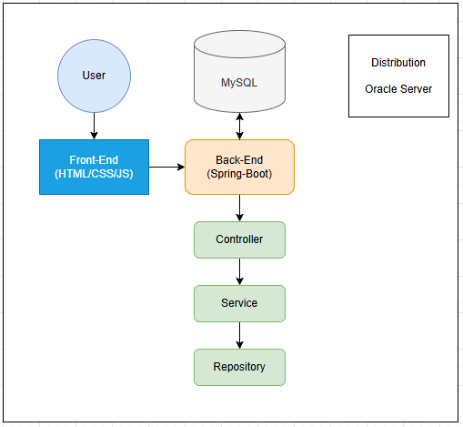
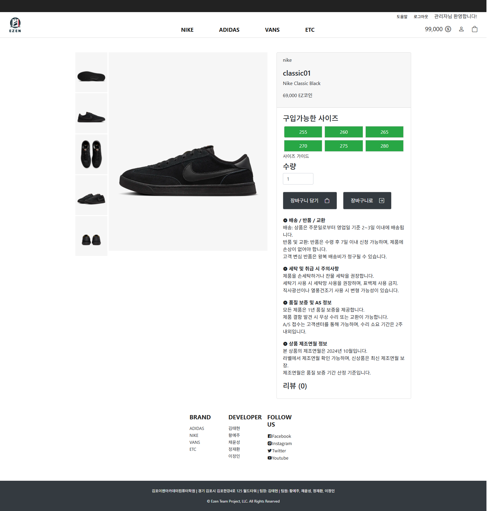
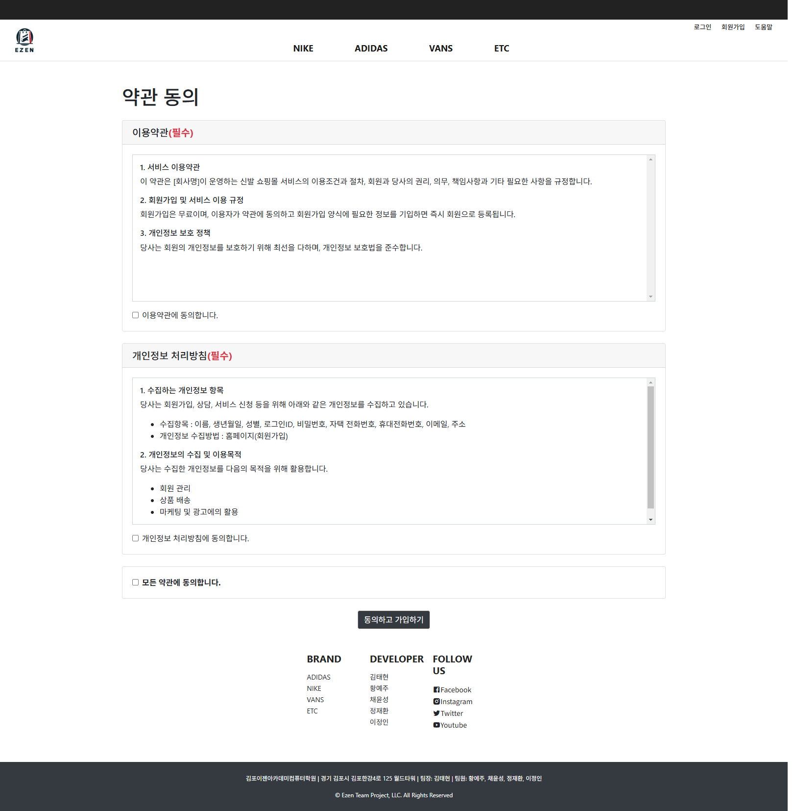

# 📚 웹 애플리케이션 개요

## 1. 🚀 프로젝트 이름

**Ezen Shoes ShoppingMall**  
🔗 [웹사이트 바로가기](http://ezenbookstore.kro.kr:8081/)

---

## 2. 📖 프로젝트 개요

- **📌 목적**: 온라인 이커머스 프로젝트에 대한 이해 및 학습을 위한 팀 프로젝트
- **🎯 주요 목표**:
  - ✅ 유저 / 관리자별 기능 제공
  - ✅ 회원가입, 로그인, 내정보 수정 기능
  - ✅ 장바구니, 구매기록 기능
  - ✅ 배송비 시스템 (조건부 무료)
  - ✅ 결제 및 조회 기능 - (PG사 연동 X)
  - ✅ 상품 및 게시판 등록 및 관리 - (리뷰, 공지사항 등)

---

## 3. 🔧 기술 스택

### 🛠️ 개발 도구

 

### 🎨 프론트엔드

    

### 🔙 백엔드

   

### 🗄️ 데이터베이스

### 🤝 협업 도구

   

### ⚙️ 기타 도구

##   

## 4. 👥 참여자 및 역할

| 이름        | 역할 | GitHub                                   | Email                   |
| ----------- | ---- | ---------------------------------------- | ----------------------- |
| 팀장 김태현 | [백엔드 (사용자 페이지)]   | [GitHub](https://github.com/qsdcv301)    | <qsdcv301@naver.com>    |
| 팀원 채윤성 | [백엔드 (사용자 페이지)]   | [GitHub](https://github.com/ChaiTope)    | <gksmsk5094@gmail.com>  |
| 팀원 이정인 | [백엔드 (사용자 페이지)]   | [GitHub](https://github.com/GreatOvOb)   | <dlwjddls888@gmail.com> |
| 팀원 정재환 | [프론트엔드 (사용자 페이지)]   | [GitHub](https://github.com/JaeHwan2569) | <jjjhhh2569@gmail.com>  |
| 팀원 황예주 | [프론트엔드 (사용자 페이지)]   | [GitHub](https://github.com/HwangYeJoo)  | <jooland05@gmail.com>   |

## 5. 📜 주요 기능 설명

### 💻 사용자 페이지

- 🔑 **회원가입 및 로그인**
  - 일반 회원가입, 로그인, 아이디 비밀번호 찾기 기능제공
- 👩‍🦲 **마이페이지**
  - 개인 정보 확인 및 변경기능, 구매 기록 확인,계정탈퇴 기능
- 🛒 **장바구니**
  - 상품의 구매와 찜 기능을 한 페이지로 효율적으로 관리
- 📜 **카테고리 분류**
  - 헤더의 navigation기능으로 효율적인 상품 조회 가능
-  **사이트 이용 도움말**
  - 이용안내, 배송안내등 사이트 이용에 도움되는 정보 기록

---

## 6. 📐 아키텍처 다이어그램

| 다이어그램 유형            | 이미지                                                            |
| -------------------------- | ----------------------------------------------------------------- |
| 시스템 아키텍쳐 다이어그램 |  |
| 프로세스 다이어그램        |  |

---

## 7. 🛢️ DB(RDBMS)

### 관계형 데이터베이스 설계

- **데이터 무결성 및 효율성**

  - **정규화**: 데이터 중복을 최소화하기 위해 테이블을 정규화하여 설계
  - **인덱스 설계**: 외래 키 및 자주 조회되는 필드에 인덱스를 설정하여 쿼리 성능 최적화

- **확장성 및 유지보수성**

  - **모듈화된 테이블 구조**: 각 기능별로 테이블을 분리하여 향후 기능 추가 및 변경 시 유연하게 대응
  - **외래 키 및 관계 설정**: 테이블 간의 관계를 명확히 정의하여 데이터 연동 강화

- **보안 및 접근 제어**

  - **민감한 사용자 데이터 암호화 저장**
    - `user` 테이블의 `password` 필드는 해시 알고리즘(Bcrypt 등)을 통해 암호화 저장
    - 이메일, 주소 등 민감한 정보는 추가적인 암호화 고려

- **역할 기반 접근 제어 (RBAC)**

  - 단순한 필드로 권한을 구분하여 부여함
  - 추가적으로 프로젝트가 커진다면 테이블로 나눠 사용자 액세스 권한을 나눌 필요가 있음

---

## 8. 📊 ERD

| ERD | 이미지                            |
| --- | --------------------------------- |
| ERD |  |

---

## 9. 🖼️ 화면 예시

| 화면 설명                         | 이미지                                                                  | 설명                                                                        |
| --------------------------------- | ----------------------------------------------------------------------- | --------------------------------------------------------------------------- |
| 메인 페이지                       |                               | 메인 페이지는 사용자가 사이트에 처음 접속했을 때 표시되는 기본 화면입니다.  |
| 상품 메인 페이지                  |                   | 상품 목록을 확인할 수 있는 페이지입니다.              |
| 상품 디테일 페이지                |                  | 상품 클릭시 상품의 상세정보를 볼 수 있는 상품 디테일 페이지입니다.          |
| 회원가입1 페이지                  |                       | 회원가입전 약관을 확인하는 페이지입니다.                                         |
| 회원가입2 페이지                  |                       | 회원가입을 할 수 있는 페이지입니다.                                         |
| 로그인 페이지                     |                            | 회원가입 후 로그인 할 수 있는 페이지입니다.          |
| 마이페이지 - 나의정보             |           | 가입한 정보를 확인하고 수정할 수 있는 페이지입니다.                         |
| 장바구니 페이지                   |                           | 사용자가 선택한 상품들을 확인하고 결제를 진행할 수 있는 페이지입니다.       |
| 도움말 페이지                    |                           | 홈페이지에 관련된 궁금한 사항을 모아 안내하는 페이지입니다.                    |

---

## 10. 📅 참고 사이트

- 🌐 [NIKE](https://www.nike.com/kr/) : 상품목록페이지 및 상세페이지의 UI 디자인, 헤더 UI 디자인을 참고했습니다. (참고일 : 2024년 9월 25일)
- 🌐 [Adidas](https://www.adidas.co.kr/) : 메인페이지의 UI 디자인을 참고했습니다. (참고일 : 2024년 9월 25일)

---

## 📎 부록

- 📑 **협업 문서**: [GoogleSheets](https://docs.google.com/spreadsheets/d/1WWVkoUGsloOn0snaAWEqKUIScwqnn0oSytphYaBP-OQ/edit?gid=1316505573#gid=1316505573)
